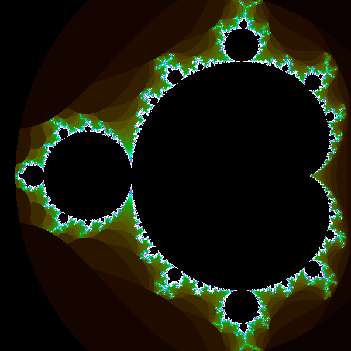

# Mandelbrot

Calculating a [mandelbrot set](https://en.wikipedia.org/wiki/Mandelbrot_set) with multiple languages for benchmarking.



## Calculations

At the moment there are four calculations written in two languages:

1. Javscript Recursively.
   Written in Node.js, using a recursive algorithm.
2. Javscript Iteratively.
   Written in Node.js, using a iterative algorithm.
3. Elixir Single. Written in Elixir, without any concurrent calculations.
4. Elixir Multi. Written in Elixir, with concurrent calculations.

## How to run?

Assuming Node and Elixir are installed, run:

```
bash run.sh
```

If you only want to run the scripts of one language:

```
bash run_js.sh
bash run_ex.sh
```

Result files will be generated and placed in `results/`.

Parameters can be edited in `.envrc`.

`index.html` will illustrate the mandelbrot images. Serve with local server, for example:

```
npx http-server -p 4000
```

and visit `localhost:4000` in your web browser.

## Current Benchmarks

```
Javascript Recursive:
0m7.424s

Javascript Iterative:
0m6.535s

Elixir Single:
0m21.274s

Elixir Multi:
0m12.688s
```
